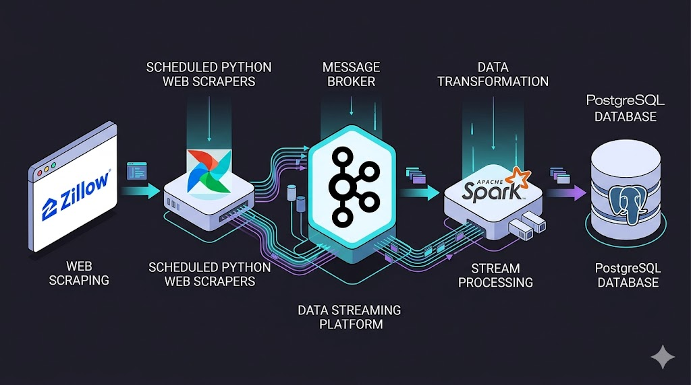

# 🏡 Real Estate Data Engineering Pipeline



## 📌 Overview
This project is an end-to-end Data Engineering pipeline that scrapes real estate data from Zillow, streams it through a message broker, processes it in real-time, and stores it in a relational database for downstream analytics.

### 🔄 Data Architecture
1. **Orchestration & Extraction (Apache Airflow & Scrapling)**: Scheduled Airflow DAGs run Python tasks that scrape real estate listings across 41 US states.
2. **Message Broker (Apache Kafka)**: The scraped raw JSON data is produced and streamed directly into Kafka topics.
3. **Stream Processing (Apache Spark)**: PySpark Structured Streaming consumes the real-time messages, applies a structured schema, formats timestamps, and cleans the data.
4. **Data Warehouse (PostgreSQL)**: The processed data is loaded into a PostgreSQL database, ready for querying and visualization.

---

## 🚀 Getting Started

### Prerequisites
- Docker & Docker Compose
- Python 3.9+
- Make

### 1️⃣ Environment Setup

Before starting the pipeline, initialize the necessary directories and environment variables for Airflow:

```bash
cd Docker
mkdir -p ./dags ./logs ./plugins ./config
echo -e "AIRFLOW_UID=$(id -u)" > .env
echo -e "SPARK_NO_DAEMONIZE=true" > .env.spark
```

### 2️⃣ Initialize Database & Start Services

Initialize the Airflow database and start all infrastructure components (Airflow, Kafka, Spark, PostgreSQL):

```bash
# Initialize Airflow DB
docker compose up airflow-init

# Start all Docker services in detached mode
docker compose up -d
```

### 3️⃣ Trigger the Pipeline

Once the containers are running, you can activate the Airflow DAG to start scraping and producing messages to Kafka, and submit the Spark job to consume and process the data:

```bash
# Turn on the Kafka Producer DAG in Airflow
make turn-on-dag

# Submit the PySpark streaming job
make submit-spark-job
```

---

## 🛠️ Local Scraper Setup (Optional)
If you want to run or test the `scrapling` scraper locally outside of Docker:

```bash
cd scraper
python3 -m venv .venv
source .venv/bin/activate
pip install "scrapling[fetchers]"
scrapling install
python scraper.py
```

## 🧹 Cleanup
To spin down the infrastructure and remove orphans/volumes:

```bash
cd Docker
docker compose down --volumes --remove-orphans
```